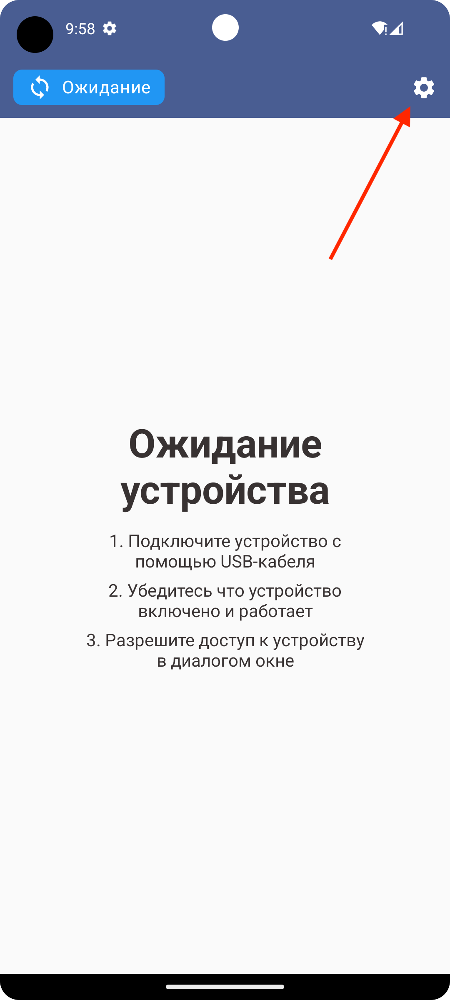
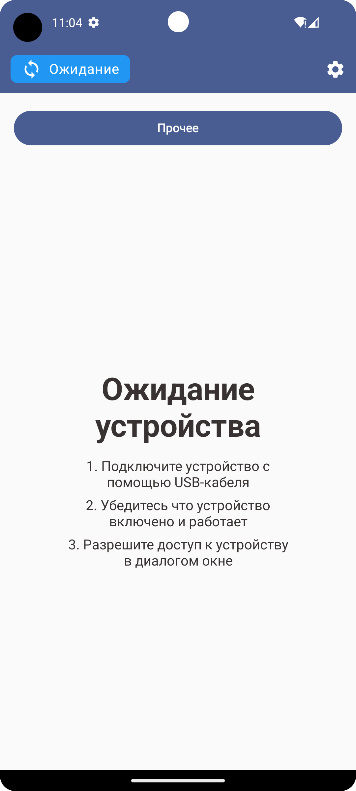
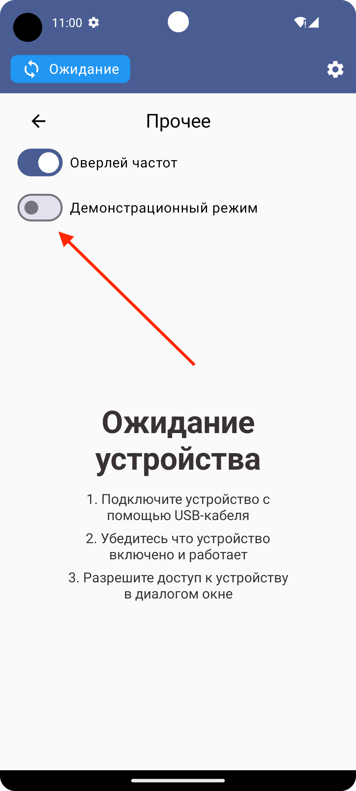

## Тестирование

### Поддерживаемый SDR
На текущий момент поддерживаются устройства производителя Arinst серии SSA.

Для тестирования на реальном SDR необходимо следовать инструкциям на главном экране приложения.

### Демонстрационный режим
В целях тестирования и отладки в приложении предусмотрен демонстрационный режим.
В этом режиме эмулируется работа реального устройства, обеспечивая непрерывный поток данных.

Для активации демонстрационного режима необходимо:
1. Открыть приложение
2. Нажать на иконку "Настройки"

3. Перейти в подменю "Прочее"

4. Включить переключатель "Демонстрационный режим"

